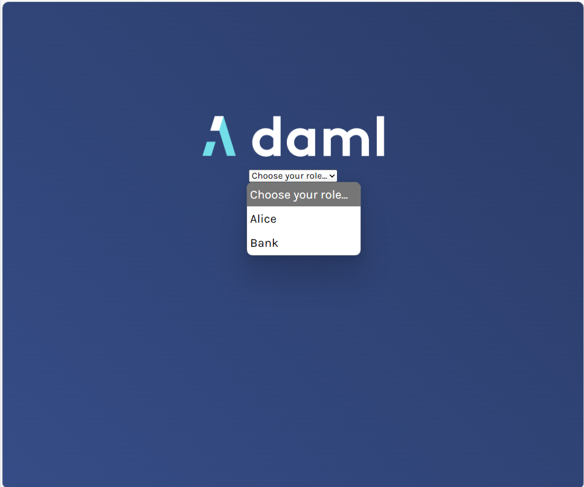
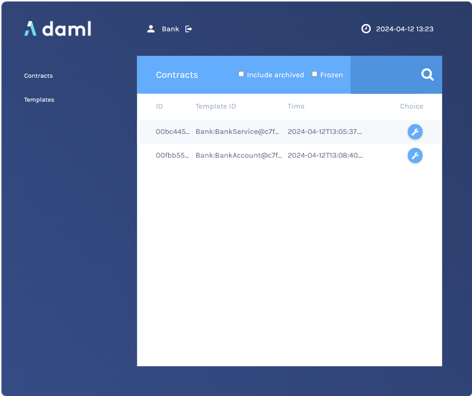
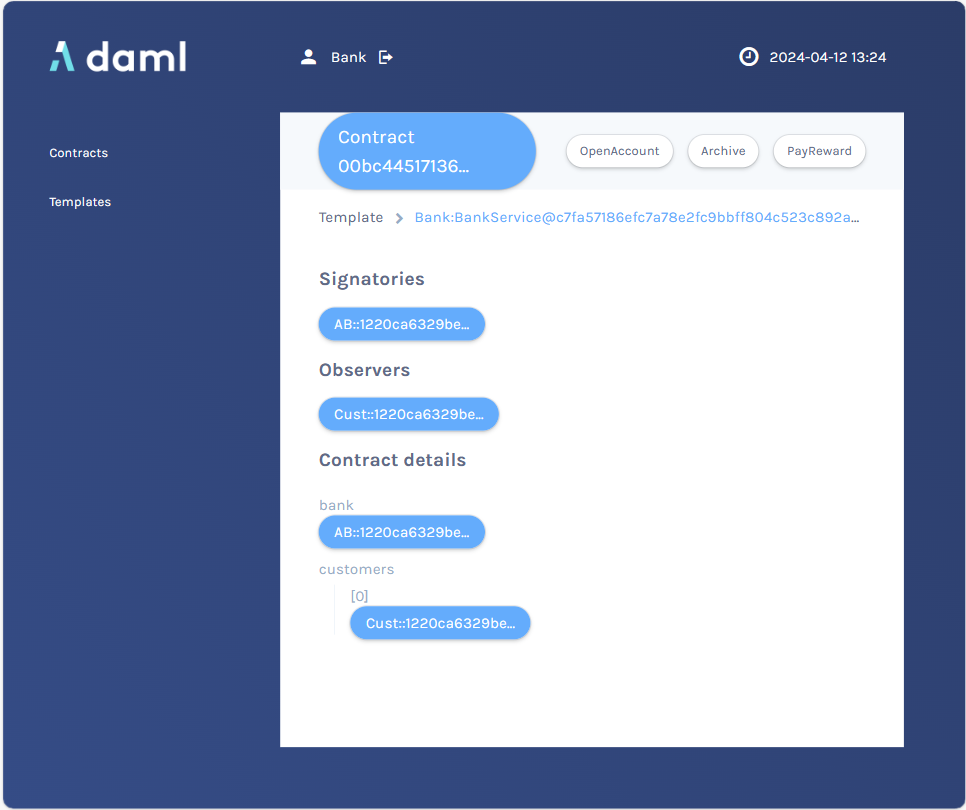
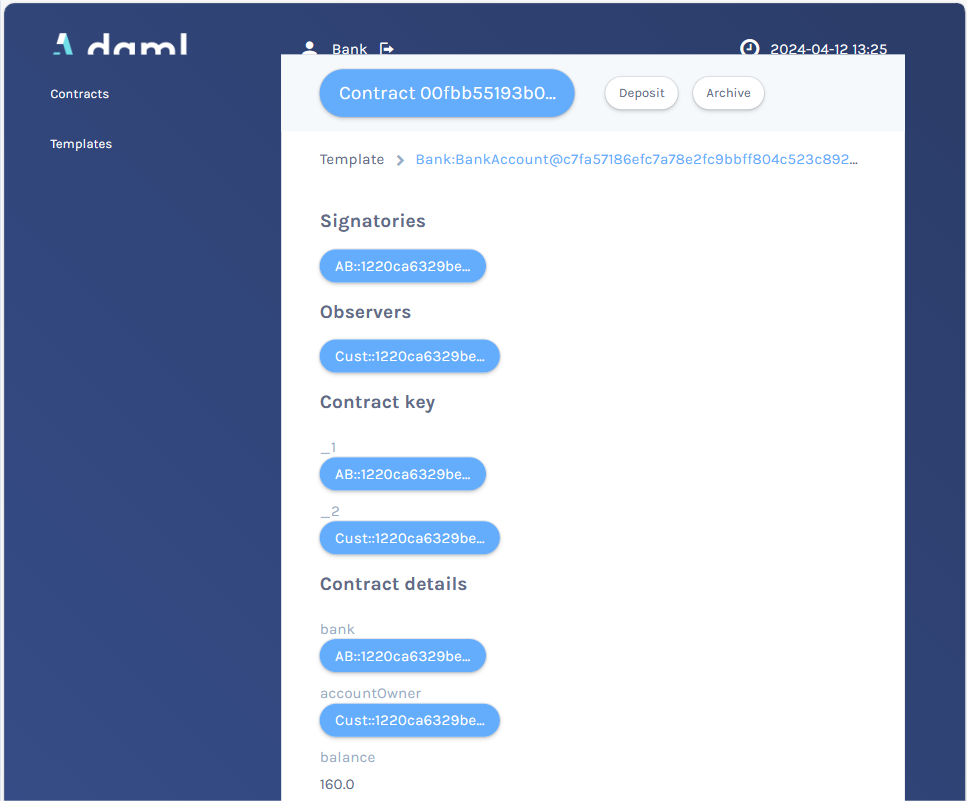
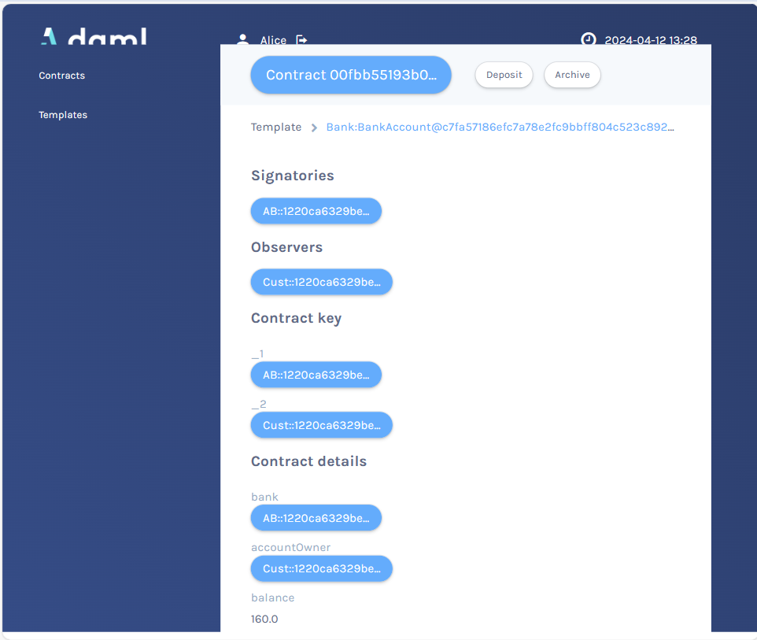

# DAML - Navigator 

  ## Description

  A demo application built with DAML for use with the DAML Navigator UI.  This is a sample Bank Account smart contract application.

  
  ### App Screenshots
  #### Login as either the "Bank" or the "Customer" (aka "Alice")
  

  #### Bank user screen
  

  #### BankService contract
  

  #### Bank view of customer's account
  

  
  #### Customer user screen
  
  
  ## Table of Contents
  
  - [Installation](#installation)
  - [Usage](#usage)
  - [License](#license)
  - [Contributing](#contributing)
  - [Tests](#tests)
  - [Questions](#questions)
  
  ## Installation
  
  run the command "daml start" when in your project folder (assumes you have DAML installed already")
  
  ## Usage
  
  use the DAML Navigator to log in either as a bank or a customer. As a bank, you can  open a new account for a customer or pay rewards to a given customer bank account.  You can view all customer accounts. As a customer you can view your account balance and deposit funds.

  ## License
This application is covered under the MIT License.
 For more information: https://opensource.org/licenses/MIT
  
  ## Contributing
  N/A
  
  ## Tests
  N/A

  ## Questions
  Contact Info 
  GitHub user name: BillStephens2022 
  Link to GitHub profile: https://github.com/BillStephens2022 
  Email: stephensbill17@gmail.com